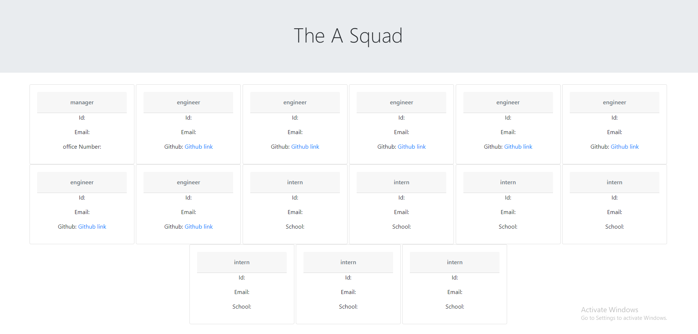

# team-profile-generator

deployable example website https://brettfleming.github.io/team-profile-generator/

## Task
The main goal of this project was to create a functioning team page generator, that use node js and javascript to dynamically generate the page from the user inputs in the command prompt. 

## Table of Contents
- [Task](#task)
- [Description](#description)
- [Installation](#installation)
- [Usage](#usage)
- [Contributing](#contributing)
- [Tests](#tests)

## Description
This is a team webpage generator that task user input and dynamically generates a webpage for the users as a baseline, this project most uses node js and inquirer to do most of the backend stuff, we use both node and inquirer to collect the data from the user via the command prompt which then in return spits out the data to the javascript generator to make the html page.  

## Installation
you will need to run npm init and npm install for this prject to work. 

## Usage
The basic usage fot this project is to quickly generate a basic dev team  web page that would have each team member on their own card with all of their details that was provided to by the manager. 

## Contributing
The only one to contribute to this project so far is me.

## Tests
no tests at the moment